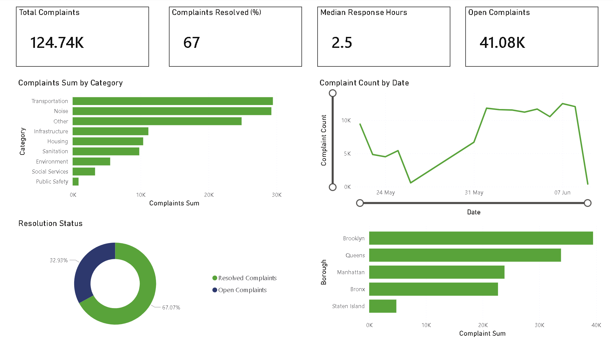
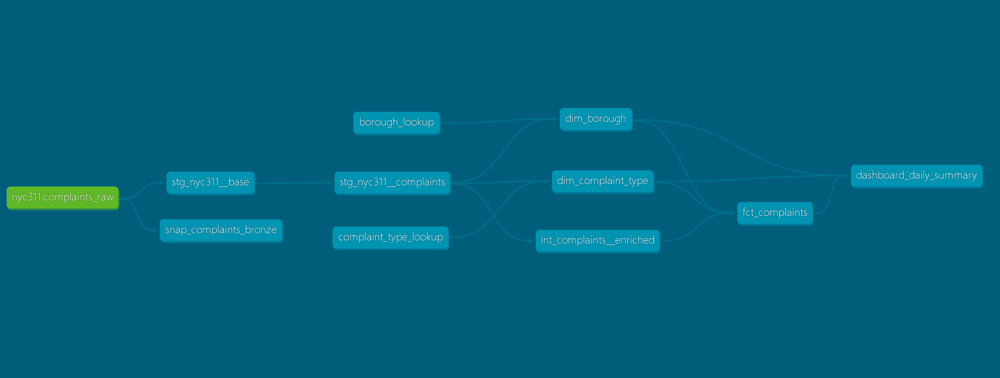

# 🗽 NYC 311 Data Pipeline

> A production-grade ELT pipeline that ingests NYC 311 complaint data from the Socrata Open Data API and transforms it into an analytics-ready Snowflake warehouse, orchestrated end-to-end with Airflow.

[](https://www.getdbt.com/)
[](https://www.snowflake.com/)
[](https://airflow.apache.org/)
[](https://www.docker.com/)
[](https://www.python.org/)
[](https://github.com/TihimRahman/NYC311-Data-Pipeline/actions/workflows/dbt-ci.yml)
[](LICENSE)


---
## 📖 Overview

This project ingests **NYC 311 service requests** — noise complaints, potholes, heat outages, rodent sightings, illegal parking, and 150+ other complaint types — from the city's public API into a fully-modeled Snowflake warehouse. Each run pulls the most recent requests (configurable; defaults to 10,000 per run via `MAX_RECORDS`), and the incremental models accumulate history across runs. It implements modern data engineering practices end-to-end: medallion architecture, dimensional modeling, incremental builds, SCD Type 2 history tracking, event-driven orchestration **(assets)** and data contracts.


---
**One click, full pipeline.** Trigger the extraction DAG in Airflow (scheduled to run at 05:00 UTC by default) and the entire chain runs unattended: API → S3 → Snowflake bronze → silver → gold star schema → reporting marts.

## 📊 Power BI Dashboard

The `dashboard_daily_summary` gold table feeds directly into Power BI via DirectQuery. Built on top of the star schema, the dashboard surfaces the key operational metrics produced by the pipeline — complaint volume, resolution rate, borough distribution, category breakdown, and daily trends.




---
## ✨ Features

### 📊 Data Modeling
- **Medallion architecture** — bronze (raw) → silver (cleaned) → gold (analytics-ready)
- **Star schema** in gold — `fct_complaints` joined to conformed dimensions (`dim_borough`, `dim_complaint_type`) via surrogate keys
- **Reporting marts** — pre-aggregated tables for fast BI consumption (`dashboard_daily_summary`)
- **Seeds** — hand-curated reference data for borough metadata and complaint type categorization
- **Unknown sentinel rows** — fact foreign keys are never NULL; missing values route to dimension sentinels (Kimball pattern)

### ⚡ Advanced dbt Patterns
- **Incremental fact table** — `fct_complaints` only processes new rows since last run via MERGE on `complaint_id`
- **SCD Type 2 snapshots** — historical tracking of complaint state transitions (status, closure, agency reassignment) from the bronze source
- **Data contracts** — every mart model declares typed column constraints; build fails on schema drift
- **Custom schema macro** — overrides dbt's default schema naming to land models in BRONZE/SILVER/GOLD directly

### 🧪 Testing & Data Quality
- **70 data tests** — uniqueness, not-null, referential integrity, accepted values, custom expressions
- **Cross-column invariants** — model-level tests asserting relationships between columns (e.g., `closed_at >= created_at`)
- **Source freshness checks** — defensive monitoring of bronze data staleness
- **Generic + singular tests** — both YAML-declared and SQL-file-defined with **JINJA** implementation

### 🪂 Orchestration
- **Event-driven chaining** — extraction DAG produces an Airflow Asset; dbt DAG consumes it (no manual triggers, no polling)
- **TaskGroups** — pipeline organized into visual phases (pre-flight, silver, gold, history)
- **Granular dbt selectors** — each task scopes to a layer for independent re-runs without rebuilding everything
- **Retries with backoff** — transient failures (network, Snowflake throttling) recover automatically
- **Execution timeouts** — prevent runaway queries from blocking the pipeline

### 📐 Production-Grade Engineering
- **Containerized** — entire pipeline runs in Docker via `docker-compose`
- **Secrets management** — credentials sourced from `.env`, injected into containers as environment variables, never committed
- **Version-controlled reference data** — seed CSVs in git, editable via PRs
- **Infrastructure as code** — `docker-compose.yml`, `Dockerfile`, and DAG files fully describe the runtime environment

---

### Full dbt Lineage

End-to-end model lineage from the bronze source through staging, intermediate, dimensions, fact, snapshot, and reporting marts:



---

## 🧱 Tech Stack

| Layer | Tool |
|---|---|
| **Extraction** | Python (`requests`, `boto3`) |
| **Storage** | AWS S3 (raw JSON landing) |
| **Warehouse** | Snowflake (BRONZE / SILVER / GOLD schemas) |
| **Ingestion** | Snowflake external stage + `COPY INTO` (Snowpipe-ready) |
| **Transformation** | dbt-core 1.10 + dbt-snowflake |
| **Orchestration** | Apache Airflow 3.0 (TaskFlow API + Assets) |
| **Containerization** | Docker + docker-compose |
| **Source data** | NYC 311 Socrata Open Data API |

---
## 📁 Project Structure

```
NYC311-Data-Pipeline/
├── ingestion/                    # Python extractor: Socrata API → S3
│   └── nyc311_extractor.py       #   batched fetch, retries, DQ checks, S3 partitioning
├── airflow/
│   ├── dags/
│   │   ├── nyc_311_extraction_dag.py   # API → S3 (produces the bronze_complaints Asset)
│   │   ├── nyc311_dbt_dag.py           # dbt build, Asset-triggered (consumes bronze_complaints)
│   │   └── assets.py                   # Airflow Asset definition linking the two DAGs
│   └── dbt_profiles/profiles.yml       # Snowflake profile (env-var driven)
├── nyc311_dbt/                   # dbt project
│   ├── models/
│   │   ├── sources/              # bronze source + freshness
│   │   ├── staging/              # flatten JSON, dedupe, normalize
│   │   ├── intermediate/         # business logic (response time, flags, buckets)
│   │   └── marts/
│   │       ├── core/             # dim_borough, dim_complaint_type, fct_complaints (contracts)
│   │       └── reporting/        # dashboard_daily_summary
│   ├── snapshots/                # SCD Type 2 history (check strategy)
│   ├── seeds/                    # borough + complaint-type reference CSVs
│   └── macros/                   # custom schema naming
├── snowflake/snowflake.sql       # warehouse / schema / stage + COPY INTO setup
├── docker-compose.yml            # Airflow + Postgres stack
└── Dockerfile                    # image with dbt + extractor deps
```

---
## 🚀 Getting Started

### Prerequisites

- Docker Desktop with WSL2 backend (Windows) or native Docker (macOS/Linux)
- Snowflake account with permissions to create databases, schemas, and tables
- AWS account with an S3 bucket and a Snowflake external stage pointing at it (load via `COPY INTO`, or wire up Snowpipe for auto-ingest)
- NYC 311 Socrata API access (optional app token for higher rate limits)
- Python 3.12+ for the extractor (if running outside the container)

### Setup

**1. Clone the repository**

```bash
git clone https://github.com/TihimRahman/NYC311-Data-Pipeline.git
cd NYC311-Data-Pipeline
```

**2. Create your `.env`**

Copy the template and fill in your values — `.env` is gitignored and never committed:

```bash
cp .env.example .env
```

```env
# Airflow
AIRFLOW_UID=50000
AIRFLOW_PROJ_DIR=.

# Snowflake
SNOWFLAKE_ACCOUNT=<your_account>
SNOWFLAKE_USER=<your_user>
SNOWFLAKE_PASSWORD=<your_password>
SNOWFLAKE_ROLE=<your_role>
SNOWFLAKE_DATABASE=<your_db>
SNOWFLAKE_WAREHOUSE=<your_warehouse>
SNOWFLAKE_SCHEMA=PUBLIC
```

**3. Ensure AWS credentials are configured locally**

The extractor uses `boto3.client("s3")` with no arguments, reading from your local AWS config (`~/.aws/credentials`). Docker mounts this into the container automatically. Run `aws configure` if you haven't already.

**4. Initialize and start Airflow**

```bash
docker compose build --no-cache
docker compose up airflow-init
docker compose up -d
```

Wait ~60 seconds, then verify:

```bash
docker compose ps
```

All seven containers should be `(healthy)`.

**5. Open the Airflow UI**
http://localhost:8080
Username: airflow
Password: airflow

### Running the Pipeline

In the Airflow UI:

1. Unpause both DAGs (toggle switches on the left)
2. Trigger `nyc311_extraction_pipeline` (play button → "Trigger DAG")
3. Watch it run (~3-5 minutes)
4. **Without any further action**, `nyc311_dbt_pipeline` auto-triggers via the `bronze_complaints` Asset
5. Watch the dbt DAG run (~2-5 minutes)

Both DAGs go green from a single click. The Assets view (top menu in Airflow) shows the lineage between them.

---

## 📊 Example Analytical Queries

Once the pipeline has run, the warehouse can answer real questions in milliseconds:

```sql
-- Complaints per capita by borough
SELECT
    b.borough_name,
    b.population_2020,
    COUNT(*) AS total_complaints,
    ROUND(COUNT(*) * 100000.0 / b.population_2020, 2) AS complaints_per_100k
FROM gold.fct_complaints f
JOIN gold.dim_borough b ON f.borough_sk = b.borough_sk
WHERE b.population_2020 IS NOT NULL
GROUP BY b.borough_name, b.population_2020
ORDER BY complaints_per_100k DESC;

-- Median response time by complaint category
SELECT
    ct.category,
    COUNT(*) AS complaints,
    PERCENTILE_CONT(0.5) WITHIN GROUP (ORDER BY f.response_time_hours) AS median_hours
FROM gold.fct_complaints f
JOIN gold.dim_complaint_type ct ON f.complaint_type_sk = ct.complaint_type_sk
WHERE f.is_resolved
GROUP BY ct.category
ORDER BY median_hours DESC;

-- Daily complaint trend with resolution rate
SELECT
    DATE_TRUNC('month', created_date) AS month,
    SUM(total_complaints) AS complaints,
    ROUND(100.0 * SUM(resolved_complaints) / SUM(total_complaints), 1) AS pct_resolved
FROM gold.dashboard_daily_summary
GROUP BY 1
ORDER BY 1;
```

---

## 🧠 Design Decisions

### Why medallion architecture?

The three-layer separation (bronze/silver/gold) makes debugging tractable. If something's wrong, you know whether it's a flattening issue (silver), business logic issue (intermediate), or modeling issue (gold) — each layer has clear ownership.

### Why surrogate keys?

Joining on hashed `borough_sk` instead of `borough_name` insulates the fact table from upstream changes. If NYC renames "Manhattan" tomorrow, only `dim_borough` needs updating; `fct_complaints` keeps working.

### Why an Unknown sentinel row?

Fact foreign keys should never be NULL. NULL FKs break `INNER JOIN` semantics, mess up `COUNT(*)` reports, and force every downstream query to special-case missing values. Routing missing values to an explicit "Unknown" row in the dimension keeps joins clean and makes missingness visible in reports.

### Why asset-driven orchestration instead of cron?

The two DAGs are decoupled — neither knows the other's name. Extraction declares it *produces* `bronze_complaints`; dbt declares it *consumes* `bronze_complaints`. If we later add a third DAG (notifications, ML training, etc.) that also depends on fresh bronze data, we just declare the same asset dependency. No code changes elsewhere.

### Why incremental on `fct_complaints` but full-rebuild on dimensions?

Dimensions are small (6 rows for borough, ~30 for complaint type) and queried often — full table rebuilds are fast and ensure consistency. Facts accumulate with every run; rebuilding the entire history from scratch each time would waste Snowflake credits as volume grows. The split matches the Kimball default.

### Why `bash` for dbt tasks instead of Python?

dbt is a CLI tool. `dbt build` prints to stdout and returns exit codes — exactly what `BashOperator` consumes. Wrapping it in Python would add a subprocess layer without benefit. This is the dbt + Airflow community standard.

---

## 🧪 Testing

Run all tests:

```bash
docker compose exec airflow-scheduler bash
cd /opt/dbt
dbt build --profiles-dir /home/airflow/.dbt
```

Run tests for a specific layer:

```bash
dbt test --select staging
dbt test --select marts.core
```

Tests include:
- Uniqueness on every primary key
- Not-null on critical columns
- Referential integrity on every foreign key (`relationships` test)
- Accepted values on categorical columns
- Cross-column invariants (e.g., `closed_at >= created_at`)
- Source freshness checks

---

## 🛠️ Common Operations

**View dbt documentation locally:**

```bash
docker compose exec airflow-scheduler bash
cd /opt/dbt
dbt docs generate --profiles-dir /home/airflow/.dbt
dbt docs serve --port 8081
```

Then open http://localhost:8081.

**Full pipeline rebuild (after schema changes):**

```bash
docker compose exec airflow-scheduler bash
cd /opt/dbt
dbt build --full-refresh --profiles-dir /home/airflow/.dbt
```

**Stop and restart Airflow:**

```bash
docker compose down
docker compose up -d
```

**Reset everything (destructive — wipes Airflow history):**

```bash
docker compose down -v
docker compose up airflow-init
docker compose up -d
```

---

## 🗺️ Roadmap

- [x] CI/CD via GitHub Actions (`dbt build` on PRs against a CI schema)
- [ ] Auto-publish dbt docs to GitHub Pages
- [ ] dbt Power User VS Code extension config
- [ ] Slack failure notifications on Airflow tasks
- [ ] Streamlit dashboard reading from `dashboard_daily_summary`
- [ ] dbt unit tests (dbt 1.8+) for `is_resolved` and response time logic
- [x] Migrate extraction DAG to Airflow Asset producer pattern

---

## 📚 Resources

- [NYC 311 Open Data](https://opendata.cityofnewyork.us/) — source of all complaint data
- [dbt Documentation](https://docs.getdbt.com/) — transformation framework
- [Snowflake Documentation](https://docs.snowflake.com/) — data warehouse
- [Airflow Documentation](https://airflow.apache.org/docs/) — orchestrator
- [Kimball Group](https://www.kimballgroup.com/) — dimensional modeling reference

---

## 📄 License

MIT

---

## 👤 Author

**Tihim Rahman** — Data Engineering portfolio project demonstrating modern ELT practices end to end: medallion architecture, dimensional modeling, incremental builds, SCD Type 2, event-driven orchestration, and full containerization.

If you're hiring data engineers or would like to discuss the project, reach me on [LinkedIn](https://www.linkedin.com/in/tihimrahmanahmed/) or [GitHub](https://github.com/TihimRahman).
